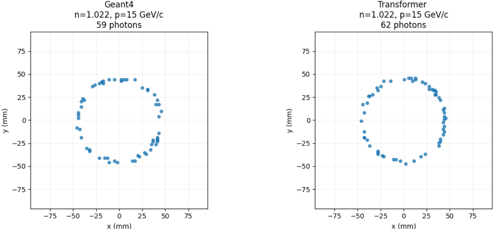
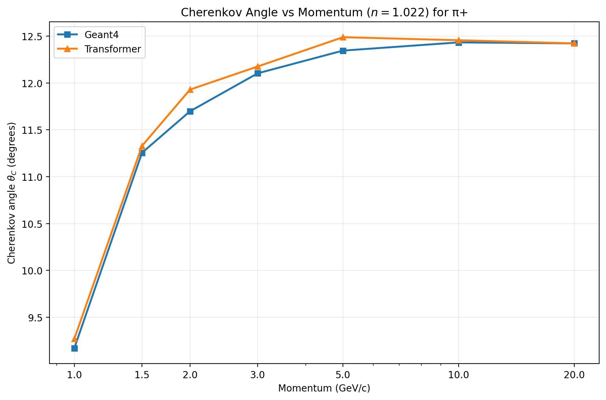
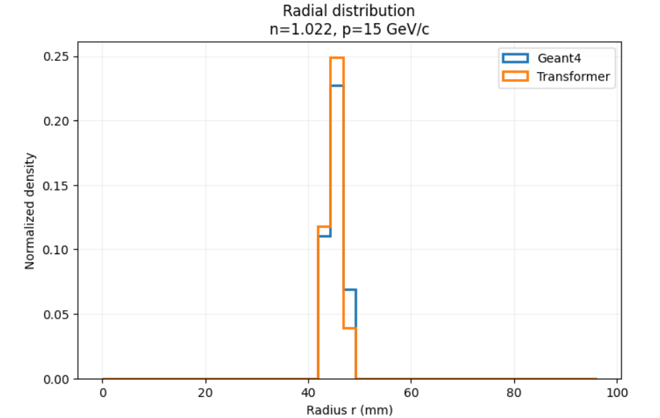
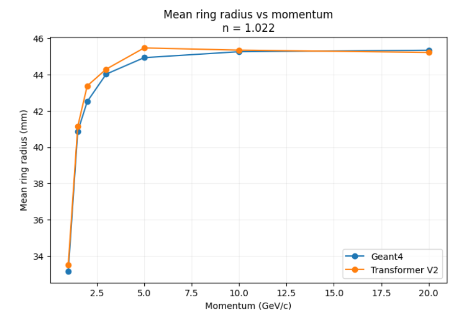
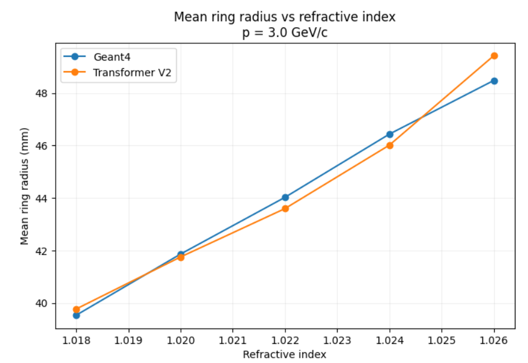

# Foundation Model for Fast Cherenkov Simulation — ePIC Experiment

## Overview

Geant4 Monte Carlo simulations are widely used to study particle detectors, but
they can be computationally expensive when a large number of events are
simulated.

This project explores a Transformer-based Mixture-of-Experts (MoE) model to
learn detector hit patterns from Geant4 simulations and generate similar
patterns in less time.

The current work uses an aerogel Cherenkov detector and studies the response
for different particle momenta and refractive indices, with the aim of
developing a fast simulation approach for the ePIC experiment.

## Detector Simulation

The detector response was simulated using Geant4 for $\pi^+$ particles at
different momenta and refractive indices.

The main quantities studied include:

- Detector hit patterns
- Cherenkov ring radius
- Cherenkov angle
- Dependence on particle momentum
- Dependence on refractive index

## Transformer-based Mixture-of-Experts Model

A Transformer-based Mixture-of-Experts (MoE) model was developed to learn the
patterns produced by the Geant4 simulations.

A custom tokenization method was used to represent detector hit positions and
photon energies as input tokens.

The model was trained using 500,000 simulated events.

## Results

### Cherenkov Ring

The detector hit patterns form a characteristic Cherenkov ring.

### Cherenkov Angle vs Momentum

The Cherenkov angle was studied as a function of particle momentum.

### Radial Distribution

The radial distribution of detector hits was compared between the Geant4
simulation and the model output.

### Different Momenta

The detector response was studied at different particle momenta to examine how
the hit patterns and Cherenkov ring change.

### Different Refractive Indices

The effect of different refractive indices on the detector response was also
studied.

## Geant4 vs Model

The model results are compared with Geant4 using:

- Ring radius
- Cherenkov angle
- Radial hit distribution

The model is able to reproduce the main features of the Geant4 detector
response.

## Current Work

The work is currently in progress, with ongoing efforts to improve the model
and extend the approach towards fast simulation of the ePIC dRICH detector.

